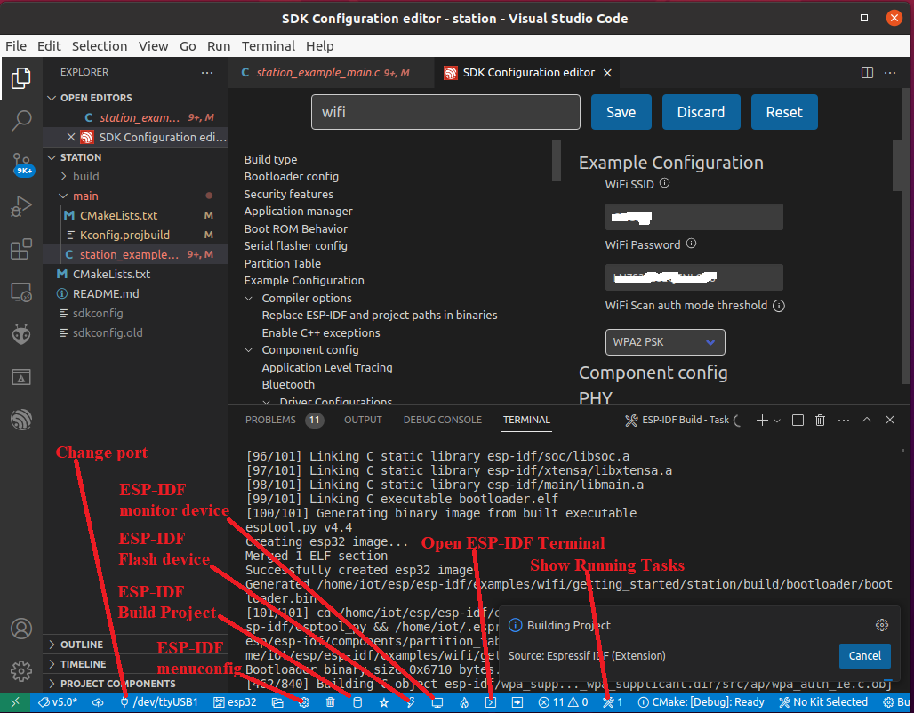
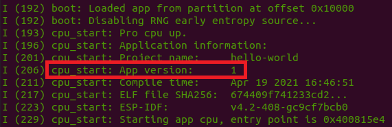
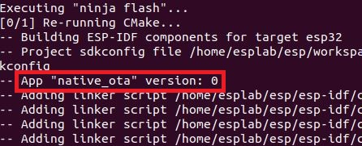
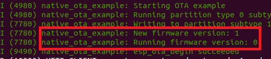
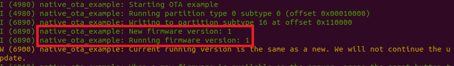
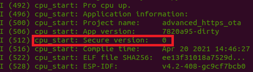
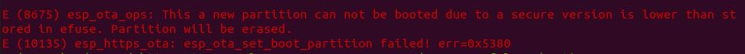

# Secure ESP32 OTA through HTTPS

## Introduction

This page is intended to guide users through the OTA procedure for the ESP32. The purpose of OTA is to update the firmware of an IoT device (such as ESP32) remotely and without user interaction. The ESP32 OTA mechanism supports HTTPS to securely transmit firmware over the network. The OTA mechanism can also check the security version of the firmware and compare it with the current version. Then the device may only load the new firmware if it the security version is newer than the current version — a feature known as "anti-rollback".

We will see three examples. Aside from using different APIs, the major differences are that simple_ota_example does not do a version check, native_ota_example does a version check (but not anti-rollback, so older firmware versions can still be downloaded), and advanced_https_ota supports both version check and anti-rollback. advanced_https_ota can also detect if the firmware has not been fully downloaded.

All referenced projects come from the [ESP-IDF OTA examples directory](https://github.com/espressif/esp-idf/tree/master/examples/system/ota), with the exception of Hello World, which can be found [here](https://github.com/espressif/esp-idf/tree/master/examples/get-started/hello_world). The assumption is that you have set up ESP-IDF to version 4.* (e.g., 4.2).

### Notes

#### Command line commands v.s. ESP-IDF Explorer icons/shortcuts in VS Code 



#### Downloading examples

**Note**: By default, this project is already located in the ``` ~/esp/IoT-Examples/ ``` directory of the Ubuntu VM.

You can download all examples with the following command.
```
git clone https://github.com/PBearson/Get-Started-With-ESP32-OTA.git
```

But really, we only need the hello_world example since all other examples are part of the Espressif IoT Development Framework (esp-idf) already installed. But go ahead to download all examples in this repository so that you get the hello_world example easily. If interested, please refer to the [original OTA example docs](https://github.com/espressif/esp-idf/tree/master/examples/system/ota).

#### Bridged Adapter for Ubuntu
Before you move forward, make sure the provided Ubuntu VM uses the bridged adapter so that it will get an IP, which will be in the same subnet of our IoT kit. Here is how you configure it:
* VirtualBox Manager -> Ubuntu IoT -> Settings -> Network -> Adapter 1 -> Bridged Adapter

#### Flash size
For each example project, make sure you change the flash size to 4MB since the OTA needs more flash. Here is how you do it with the settings of an example project:
* Settings -> Serial flasher config -> Flash size to 4MB.

#### Simple https web server
We will start a simple https web server using openssl. You can create a folder called "server" within /home/iot. The server folder will host the https web server's private key, self-signed certificate and the firmware for upgrading.

## Prepare the OTA Firmware Images

We are going to prepare 3 different versions of the "Hello World" firmware: 1) no version; 2) app version 1 without anti-rollback support; 3) app version 2 with anti-rollback support and security version 1.

### Unversioned App

Navigate to the "hello_world/" directory and run ```idf.py build```, which will build the "Hello World" binary. The binary will be generated in the "build/" directory, under the filename "hello-world.bin". Please copy this image/firmware to our server directory /home/iot/server.

### App Version 1

To specify the app version, run ```idf.py menuconfig``` and enable the option **Application Manager -> Get the project version from Kconfig**. Now a new option appears that says **Project version**, which is set to 1 by default. Leave it as is. Exit the config menu and make sure to **save your changes**. Re-run the build command ```idf.py build``` to incorporate these changes into the firmware. Please copy this image/firmware, which is located in the  to the server directory /home/iot/server.

Optionally, you can run this firmware now to confirm that the app detects the version. Run ```idf.py flash monitor``` to upload the firmware and monitor the console output from the device. In the bootloader log, you should see the version detection, as shown below:



### App Version 2 / Security Version 1

Now we will change the app version to 2 and add the anti-rollback support, which depends on a _security version_ that is separate from the app version. Open the config menu again by running ```idf.py menuconfig```. First change the app version by setting **Application Manager -> Project version** to 2. Now go to **Bootloader config** and enable the option **Enable app rollback support**. Note that this reveals a new option, **Enable app anti-rollback support**. Make sure to enable this new option. To set the security version, set **eFuse secure version of app** to 1. Finally, make sure to enable **Emulate operations with efuse secure version(only text)**. _If you do not do this, then the anti-rollback support and secure version are saved in the hardware efuse rather than the software, and the changes will be irreversible_.

There is more to do before we leave the config. Navigate to **Partition Table -> Partition Table** and change it to "Custom partition table CS". Apps with anti-rollback support require a different partition table than the default. I have already added the required partition table in the file "partitions.csv". Next we need to increase the Partition Table Offset to 0x9000.

Now you can exit and save the changes to the configuration. Run ```idf.py build``` to rebuild "Hello World". Copy this to the server directory by running ```cp build/hello-world.bin ~/server/hello-world-version-2.bin```.

Optionally, you can run this firmware now to confirm that the app detects the version. Run ```idf.py erase_flash``` to erase the previous firmware off the chip. Then run ```idf.py flash monitor``` to upload the firmware and monitor the console output from the device. In the bootloader log, you should see both the app version and the security version, as shown below:


## Start the Web Server

The next step is to start the web server at our Ubuntu VM. If you are working within a virtual machine (VM) using something like VirtualBox, then you should modify the network settings of your VM to use a bridged adapter rather than NAT (the default) so that the Ubuntu VM and our IoT kit will be in the same subnet. We will use OpenSSL to run a simple HTTPS server on our local machine. Since your ESP32 must be able to access this server, you need to ensure your machine is accessible to the local network and does not block traffic to the chosen HTTP port (in my case, it will be 8070). 

At this point, I would advise you to open a separate terminal window, since this is where the server will be running. First, make a note of your IP address by running the command ```ifconfig```.  Navigate to the "server" directory and generate a server keypair and certificate using the following command 
* ```openssl req -x509 -nodes -days 365 -newkey rsa:2048 -keyout ca_key.pem -out ca_cert.pem```. 

This will generate an RSA keypair and a self-signed server certificate. You will fill out the fields of the certificate. The only field that matters is "Common Name", which **must** match the IP address of your local machine (for example, in my case, the Common Name is "192.168.1.169" because that is my IP address). To run the server on port 8070 using the server certificate, run 
* ```openssl s_server -WWW -key ca_key.pem -cert ca_cert.pem -port 8070```

## Run the simple_ota_example Project

Leave the server running and return to the original terminal. We are going to run the first OTA project now. Navigate to the "simple_ota_example" directory. Make a new directory called "server_certs" under by running ```mkdir server_certs``` if you do not have one . Now copy the server certificate to this new directory by running ```cp ~/server/ca_cert.pem server_certs/```. This is necessary to authenticate the server during the TLS handshake.

Open the config menu by running ```idf.py menuconfig```. Navigate to **Example Configuration** and change **firmware upgrade url endpoint** to "https://_\<your IP\>_:8070/hello-world-unversioned.bin". Navigate to **Example Connection Configuration** and update the WiFi credentials with your SSID and password. Finally, navigate to **Partition Table -> Partition Table** and change it "Factory app, two OTA definitions". Now exit the configuration and save your changes.

Build and run the firmware using ```idf.py flash monitor```. The app will start by running the OTA firmware, which will try to connect to your running HTTPS server. If all goes well, you will see the ESP32 download the "hello-world-unversioned.bin" firmware, reset the system, and begin running the updated firmware.

## Run the native_ota_example Project

Now we are going to run the second OTA project. Navigate to the "native_ota_example" directory. Create the "server_certs" directory and copy the server certificate to this new directory, just as before.

The app version is stored in a text file called "version.txt" and will be compiled into the binary when we run the build command. By running the command ```cat version.txt```, we can see that the app version is currently set to 0. By contrast, recall that for "hello-world-version-1.bin", we set the app version to 1. We will see the effect of the OTA mechanism when the app version is increased, decreased, or remains the same.

### Updating to a New App Version

Open the config menu by running ```idf.py menuconfig``` and change the following settings:

* **Serial flasher config -> Flash size**: change to 4 MB to support the larger image size.
* **Partition Table -> Partition Table**: change to "Factory app, two OTA definitions"
* **Example Configuration -> Firmware Upgrade URL**: change to "https://_\<your IP\>_:8070/hello-world-version-1.bin"
* **Example Connection Configuration**: set your WiFi SSID and WiFi Password

Build and run your app using ```idf.py flash monitor```.

Although the process is very similar to the previous example, you may notice 2 points of interest. First, we can see that the app version is detected during the compilation, as shown in the output from the build step:



Second, when the firmware is running, after it connects to the HTTPS server and downloads the new firmware, we can see that it successfully detects the new app version (1) and compares it with the current app version (0), which prompts it to complete the OTA process and boot from the new firmware:



### Trying to Update to the Same App Version

Now we will see what happens when the current firmware and the new firmware have the same version. Change the value of "version.txt" to 1 by running ```echo 1 > version.txt```, and build and run your app using ```idf.py flash monitor```.

You will notice that although the new firmware downloads successfully, we get a warning indicating that the new version is the same as the running version, so the OTA process does not complete:



### Updating to a Previous App Version (No Anti-Rollback)

Now we will see what happens when the current firmware has a larger app version than the new firmware. Change the value of "version.txt" to 2 by running ```echo 2 > version.txt```. Now build and run the app using ```idf.py flash monitor```.

The OTA process completes successfully, and the "Hello World" app runs just fine. This indicates that the anti-rollback mechanism has not been implemented.

## Run the advanced_https_ota Project

In the final 2 examples, we will run the last OTA project and see the anti-rollback mechanism in action.  Navigate to the "advanced_https_ota" directory. Create the "server_certs" directory and copy the server certificate to this new directory, just as before.

### Updating to a New Security Version

Open the config menu by running ```idf.py menuconfig``` and change the following settings:

* **Bootloader config -> Enable app rollback support**: Enable
* **Bootloader config -> Enable app anti-rollback support**: Enable
* **Bootloader config -> Emulate operations with efuse secure version(only test)**: Enable (_**VERY IMPORTANT**_)
* **Serial flasher config -> Flash size**: Change to 4 MB to support the larger image size.
* **Partition Table -> Partition Table**: Change to "Custom partition table CSV"
* **Partition Table -> Partition Table**: Increase offset to "0x9000"
* **Example Configuration -> Firmware Upgrade URL**: change to "https://_\<your IP\>_:8070/hello-world-version-2.bin"
* **Example Connection Configuration**: set your WiFi SSID and WiFi Password

Build and run the app using ```idf.py flash monitor```.

When the app starts to run, you will see that the bootloader can correctly detect the security version, as shown below:



From here, the device should download and run the new firmware, which has a security version of 1.

### Trying to Update to a Previous Security Version (Anti-Rollback)

Now we will change the security version of the firmware and see what happens when we try to down-grade to a previous security version. Open the config menu again using ```idf.py menuconfig``` and make the following change:

* **Bootloader config -> eFuse secure version of app**: change to 2

Now build and run using ```idf.py flash monitor```.

After the firmware connects to the server and downloads the OTA update, you will promptly be greeted with an error stating that the new firmware has a lower security version than the current firmware. Then the OTA update is deleted and the device reboots. This confirms that the anti-rollback mechanism works as intended.


