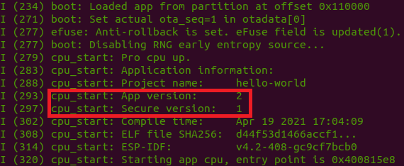

# Get Started With ESP32 OTA

## Introduction

This page is intended to guide users through the OTA procedure for the ESP32. All referenced projects come from the [ESP-IDF OTA examples directory](https://github.com/espressif/esp-idf/tree/master/examples/system/ota), with the exception of Hello World, which can be found [here](https://github.com/espressif/esp-idf/tree/master/examples/get-started/hello_world). The assumption is that you have set up ESP-IDF to version 4.* (e.g., 4.2).

The purpose of OTA is to update the firmware of an IoT device (such as ESP32) remotely and without user interaction. The ESP32 OTA mechanism supports HTTPS to securely transmit firmware over the network. The OTA mechanism can also check the security version of the firmware and compare it with the current version. Then the device may only load the new firmware if it the security version is newer than the current version — a feature known as "anti-rollback".

We will see three examples. Aside from using different APIs, the major differences are that simple_ota_example does not do a version check, native_ota_example does a version check (but not anti-rollback, so older firmware versions can still be downloaded), and advanced_https_ota supports both version check and anti-rollback. advanced_https_ota can also detect if the firmware has not been fully downloaded.

Within menuconfig, change Serial flasher config -> Flash size to 4MB.
VirtualBox Manager -> Ubuntu IoT -> Settings -> Network -> Adapter 1 -> Bridged Adapter


## Prepare the OTA Firmware Images

We are going to prepare 3 different versions of the "Hello World" firmware: 1) no version; 2) app version 1 without anti-rollback support; 3) app version 2 with anti-rollback support and security version 1.

### Unversioned App

Navigate to the "hello_world/" directory and run ```idf.py build```, which will build the "Hello World" binary. The binary will be generated in the "build/" directory, under the filename "hello-world.bin". To copy this image to our server directory, run ```cp build/hello-world.bin ../server/hello-world-unversioned.bin```.

### App Version 1

To specify the app version, run ```idf.py menuconfig``` and enable the option **Application Manager -> Get the project version from Kconfig**. Now a new option appears that says **Project version**, which is set to 1 by default. Leave it as is. Exit the config menu and make sure to save your changes. Re-run the build command ```idf.py build``` to incorporate these changes into the firmware. Copy this to the server directory by running ```cp build/hello-world.bin ../server/hello-world-version-1.bin```.

Optionally, you can run this firmware now to confirm that the app detects the version. Run ```idf.py flash monitor``` to upload the firmware and monitor the console output from the device. In the bootloader log, you should see the version detection, as shown below:


### App Version 2 / Security Version 1

Now we will change the app version to 2 and add the anti-rollback support, which depends on a _security version_ that is separate from the app version. Open the config menu again by running ```idf.py menuconfig```. First change the app version by setting **Application Manager -> Project version** to 2. Now go to **Bootloader config** and enable the option **Enable app rollback support**. Note that this reveals a new option, **Enable app anti-rollback support**. Make sure to enable this new option. To set the security version, set **eFuse secure version of app** to 1. Finally, make sure to enable **Emulate operations with efuse secure version(only text)**. _If you do not do this, then the anti-rollback support and secure version are saved in the hardware efuse rather than the software, and the changes will be irreversible_.

There is more to do before we leave the config. Navigate to **Partition Table -> Partition Table** and change it to "Custom partition table CS". Apps with anti-rollback support require a different partition table than the default. I have already added the required partition table in the file "partitions.csv".

Now you can exit and save the changes to the configuration. Run ```idf.py build``` to rebuild "Hello World". Copy this to the server directory by running ```cp build/hello-world.bin ../server/hello-world-version-2.bin```.

Optionally, you can run this firmware now to confirm that the app detects the version. Run ```idf.py erase_flash``` to erase the previous firmware off the chip. Then run ```idf.py flash monitor``` to upload the firmware and monitor the console output from the device. In the bootloader log, you should see both the app version and the security version, as shown below:



## Start the Web Server

The next step is to start the web server. We will use OpenSSL to run a simple HTTPS server on our local machine. Since your ESP32 must be able to access this server, you need to ensure your machine is accessible to the local network and does not block traffic to the chosen HTTP port (in my case, it will be 8070). For instance, if you are working within a virtual machine (VM) using something like VirtualBox, then you should modify the network settings of your VM to use a bridged adapter rather than NAT (the default).

At this point, I would advise you to open a separate terminal window, since this is where the server will be running. First, make a note of your IP address by running the command ```ifconfig```.  Navigate to the "server" directory and generate a server keypair and certificate using the command ```openssl req -x509 -newkey rsa:2048 -keyout ca_key.pem -out ca_cert.pem -days 365 -nodes```. This will generate an RSA keypair and a self-signed server certificate. You will fill out the fields of the certificate. The only field that matters is "Common Name", which **must** match the IP address of your local machine (for example, in my case, the Common Name is "192.168.1.169" because that is my IP address). To run the server on port 8070 using the server certificate, run ```openssl s_server -WWW -key ca_key.pem -cert ca_cert.pem -port 8070```

## Run the simple_ota_example Project

Leave the server running and return to the original terminal. We are going to run the first OTA project now. Navigate to the "simple_ota_example" directory. Make a new directory called "server_certs" by running ```mkdir server_certs```. Now copy the server certificate to this new directory by running ```cp ../server/ca_cert.pem server_certs/```. This is necessary to authenticate the server during the TLS handshake.

Open the config menu by running ```idf.py menuconfig```. Navigate to **Example Configuration** and change **firmware upgrade url endpoint** to "https://_\<your IP\>_:8070/hello-world-unversioned.bin". Navigate to **Example Connection Configuration** and update the WiFi credentials with your SSID and password. Finally, navigate to **Partition Table -> Partition Table** and change it "Factory app, two OTA definitions". Now exit the configuration and save your changes.

Build and run the firmware using ```idf.py flash monitor```. The app will start by running the OTA firmware, which will try to connect to your running HTTPS server. If all goes well, you will see the ESP32 download the "hello-world-unversioned.bin" firmware, reset the system, and begin running the updated firmware.

## Run the native_ota_example Project

### Updating to a New App Version

### Trying to Update to the Same App Version

### Updating to a Previous App Version (No Anti-Rollback)

## Run the advanced_https_ota Project

### Updating to a New Security Version

### Trying to Update to a Previous Security Version (Anti-Rollback)
